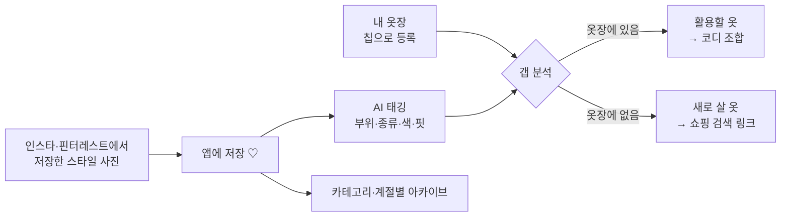

# FULL-JOIN

2026-2 AI캡스톤디자인 5팀
소프트웨어학과 202322021 최정인
소프트웨어학과 202322024 조은재

팀명은 sql의 조인 개념에서 따와 효율적이고 원활한 협업 능력을 키울 수 있도록 하겠다는 포부를 담았습니다.
동시에 팀원의 이름인 조(은재최정)인의 의미도 내포하고 있습니다.

---

## 추구미 앱 — 나의 추구미에 빠르게 도달

> 원하는 스타일이 있는 20대 여성이, **지금 있는 옷으로 입을 코디**와 **더 살 옷**을 AI에게 추천받는 앱

### 핵심 숫자

- 인터뷰 **10명 전원**이 옷을 살 때 가진 옷과 어울릴지를 **머릿속으로만** 맞춰 본다
- **10명 중 9명**이 맞춰 보지 못한 채 산 옷을 방치한 적이 있다 (가진 옷과의 조합·핏·무드가 안 맞아서)
- 그 결과 **저장한 사진 10장 중 실제로 사거나 따라 하는 건 1~2장** (10명 중 7명)
- 설문(여성 30명): 90%가 옷을 살 때 가진 옷과의 매칭을 "거의 매번" 고민

## 발견 → 정의 → 명세 (중간평가① 발표 순서)

| 순서 | 문서 | 한 줄 |
|---|---|---|
| 1 | [인터뷰 분석](docs/research/interviews.md) | 인터뷰 10건(전부 녹음 전사 확인), 페인 8개, 핵심 Job Story, 가설 판정 |
| 2 | [미니 온톨로지](docs/ontology.yaml) | 클래스 6개 — User, StyleImage, Item, WardrobeItem, Product, Outfit. 모든 항목에 로그 번호 |
| 3 | [문제 정의서](docs/PROBLEM.md) | 가진 옷·체형과 맞출 확신이 없어 구매 포기·방치. 설문 근거, 반증 조건 두 층 |
| 4 | [제품 스펙](docs/SPEC.md) | 핵심 기능: 사진 태깅 → 옷장 대조(갭 분석) → 코디 조합 + 쇼핑 링크. 수용 기준 AC1~AC13 |
| 5 | [스파이크](docs/spikes/wardrobe_matching.md) | 가장 위험한 가정: 사진 속 옷을 정확히 태깅하고 칩 옷장과 대조해 활용/구매를 사람처럼 나눌 수 있는가 |
| — | [AGENTS.md](AGENTS.md) | 용어집과 절대 규칙 (규칙마다 대응 AC 번호) |

## 핵심 흐름



## 근거 역추적 예시

`로그 9 "제 옷장에 있는 걸 최대한 찾아서 이제 그거를 이용을 하려는 편이어서 … 입고 싶은 옷이 있으면 그냥 비슷한 옷으로"` → 페인 3 (매칭을 머릿속으로) → 온톨로지 `Item.gap_status (활용/구매)` → PROBLEM 증거 "가진 옷을 먼저 활용하고 없을 때 산다" → SPEC **AC9** (옷장과 대조해 활용/구매 분류)

## 저장소 구조

```
AGENTS.md / CLAUDE.md          상시 규칙과 용어집 (CLAUDE.md는 @AGENTS.md 임포트만)
docs/research/interviews.md    강의 2 — 인터뷰 프로토콜·로그·페인·Job Story
docs/ontology.yaml             강의 2 — 미니 온톨로지
docs/PROBLEM.md                강의 4 — 문제 정의서
docs/SPEC.md                   강의 4 — 제품 스펙과 수용 기준
docs/spikes/                   강의 4 — 기술 타당성 스파이크
src/fulljoin/                  강의 3~ — 스키마, 프롬프트, 도구
tests/ · evals/                강의 5·7 — 골든 케이스, 정량 평가
```
